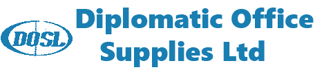
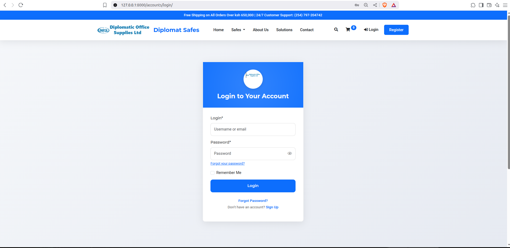
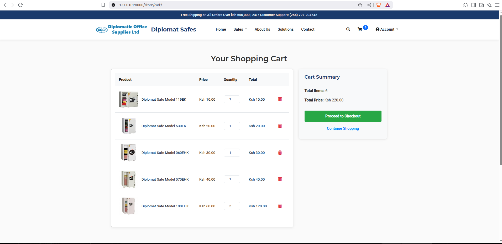
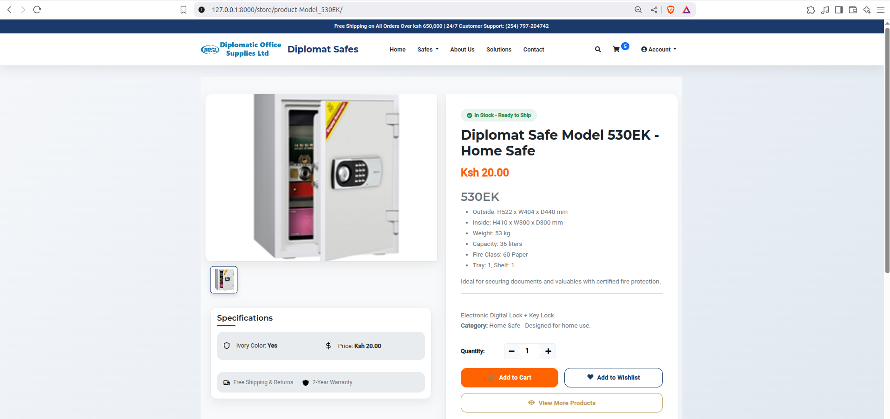
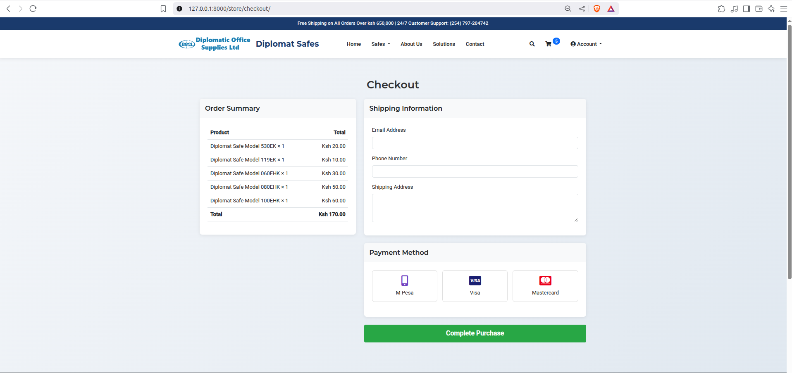

# 🌟 Diplomat Safes E-commerce Platform

**Welcome to Diplomat Safes**, your trusted source for cutting-edge security solutions designed for homes, offices, and businesses. This robust e-commerce platform, meticulously crafted with **Django 4.2** and styled using **Bootstrap 5.3**, delivers a secure, intuitive, and responsive shopping experience. Enjoy seamless transactions with support for **M-Pesa** (via Safaricom API), **Visa**, and **Mastercard** (via Stripe), alongside streamlined social authentication through **Google** and **Facebook**. Whether you're a security-conscious individual or a business owner, Diplomat Safes combines premium products with modern technology to meet your needs.

👉 **[Stay Tuned for Live Demo](#live-demo)** | **[Get Started](#installation)**

---

## 🎉 Why Choose Diplomat Safes?

Discover a world of security with Diplomat Safes, where innovation meets reliability. Our platform offers:

- 🛒 **Extensive Product Range**: Explore a diverse catalog of safes, from compact home models to large commercial units. Each product page includes detailed specifications (e.g., dimensions, weight, fireproofing), high-resolution images, and availability status.
- 🔐 **Secure & Easy Access**: Sign up or log in effortlessly using Google or Facebook accounts. Enjoy enhanced security with password visibility toggles and two-factor authentication options, ensuring your data remains protected.
- 💳 **Flexible Payments**: Choose from multiple payment methods, including M-Pesa for local transactions in Kenya, and international options via Visa and Mastercard, processed securely through the Stripe API with real-time transaction updates.
- 📦 **Smart Shopping**: Add items to your cart with instant AJAX updates, track order statuses, and receive email notifications at every step. Manage your wishlist and review past purchases with ease.
- 📱 **Mobile-Friendly**: Fully responsive design optimized for smartphones, tablets, and desktops, with touch-friendly interfaces and fast load times across all devices.
- ✨ **Modern Design**: Experience a user-friendly interface with skeleton loading screens for faster perceived performance, accessibility features (e.g., keyboard navigation, screen reader support), and smooth touch interactions for mobile users.

---

## 📷 Screenshots

Get a glimpse of the Diplomat Safes experience with these visuals. More screenshots will be added soon to showcase additional pages!

| **Login Page**                          | **Cart Page**                          | **Product Page** (Coming Soon)         | **Checkout Page** (Coming Soon)        |
|-----------------------------------------|----------------------------------------|----------------------------------------|----------------------------------------|
|  |  |  |  |
| *Secure login with social auth & password toggle* | *AJAX-powered cart with payment options* | *Detailed product views & specs*       | *Secure payment processing*            |

---

## 🛠️ Tech Stack

Our platform is built on a powerful and scalable technology stack to ensure reliability and performance:

- **Backend**:
  - **Python 3.10**: The core programming language for robust server-side logic.
  - **Django 4.2**: A high-level framework providing ORM, authentication, and admin interfaces.
  - **PostgreSQL**: A reliable, open-source database for storing product data, orders, and user information.
  - **django-allauth**: Handles social authentication and local account management.
  - **Celery**: Manages asynchronous tasks like order processing and email notifications.
- **Frontend**:
  - **Bootstrap 5.3**: Provides a responsive, mobile-first CSS framework with pre-built components.
  - **JavaScript**: Enables dynamic features like real-time cart updates and interactive elements.
  - **Font Awesome 6.4**: Offers a wide range of icons for a polished UI.
- **Payments**:
  - **Safaricom M-Pesa API**: Integrates local mobile payment solutions with STK push functionality.
  - **Stripe API**: Supports international credit and debit card transactions with fraud protection.
- **Deployment**:
  - Compatible with platforms like Heroku, AWS, and Render, with static files served via a CDN or S3 for optimal performance.

---

## 🚀 Live Demo

The full Diplomat Safes platform is currently under deployment to ensure a seamless launch. We are working to bring you a live experience soon! Check back for updates or follow our progress. The anticipated live demo will be available at [Diplomat Safes](https://diplomat-safes.herokuapp.com) (coming soon!). In the meantime, explore the code and set up a local instance using the instructions below.

---
